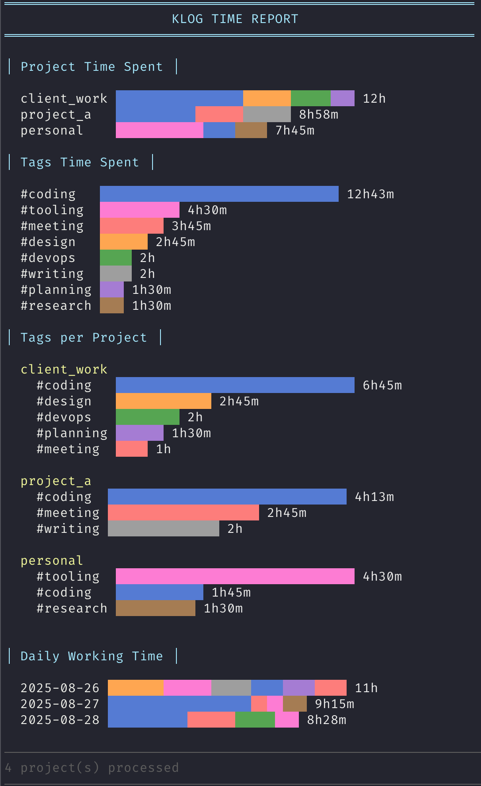

# klogreport

A command-line tool that generates beautiful time tracking reports from [klog](https://klog.jotaen.net) files.

## Features

- **Project Time Spent**: Shows total time logged per project
- **Tags Time Spent**: Aggregates time across all projects by tags
- **Tags per Project**: Breaks down tag usage within each project
- **Daily Working Time**: Shows daily time totals across all projects
- Colorful bar charts with dynamic scaling
- Automatic detection of `.klg` files in specified directory

## Screenshot



## Installation

1. Make sure you have [klog](https://klog.jotaen.net) installed
2. Build the program:
   ```bash
   go build -o klogreport main.go
   ```

## Usage

Set the `KLOG_DIR` environment variable to point to your klog files directory:

```bash
export KLOG_DIR=/path/to/your/klog/files
./klogreport
```

Or specify it inline:

```bash
KLOG_DIR=/path/to/your/klog/files ./klogreport
```

If `KLOG_DIR` is not set, it defaults to `~/klog`.

## Dependencies

- [klog](https://klog.jotaen.net) - Must be installed and available in PATH
- [fatih/color](https://github.com/fatih/color) - Terminal colors

## License

MIT
